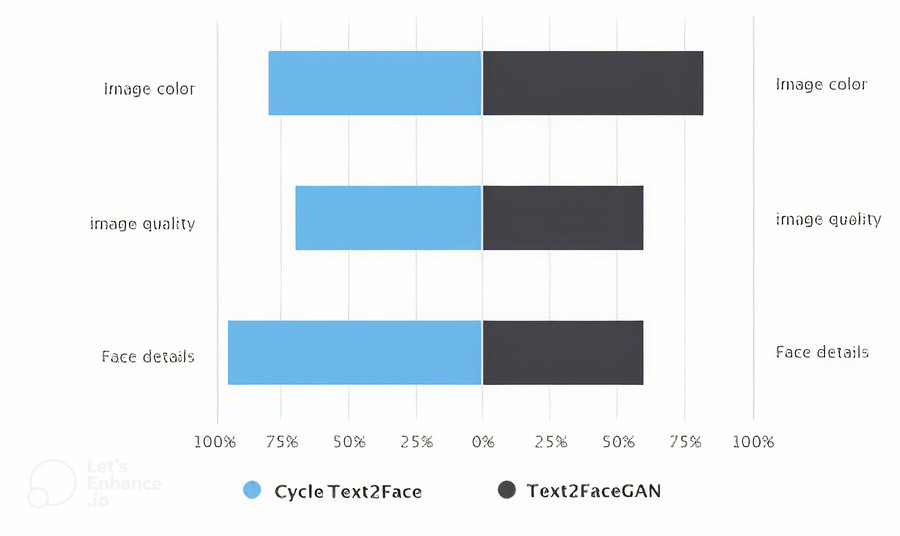

# Text to Face

A Novel Encoder-Decoder Approach for Text-to-Face Conversion using Generative Adversarial Networks and Attention Mechanism

This repository contains a TensorFlow implementation for generating face images using the GAN-CLS Algorithm, as described in the paper [Generative Adversarial Text-to-Image Synthesis][1](https://proceedings.mlr.press/v48/reed16.html). The model is built upon the solid foundation of the [DCGAN in TensorFlow][2](https://github.com/tensorlayer/DCGAN).

With the ability to handle input descriptions in over 100 languages, this implementation is highly versatile and adaptable. This means you can generate face images based on textual descriptions in various languages.

To train and evaluate the model, we utilize the large-scale CelebFaces Attributes (CelebA) dataset, which provides a diverse set of realistic human faces.

Image Source : [https://s3-us-west-1.amazonaws.com/udacity-dlnfd/datasets/celeba.zip]

Caption source : [https://raw.githubusercontent.com/midas-research/text2facegan/master/data/caps.txt]

## Results

-This Face is from the caption ”The woman has oval face and high cheekbones. She has wavy hair which is brown in colour.She has arched eyebrows.The smiling, young attractive woman has heavy makeup. She’s wearing earrings, necklace and lipstick.”Is produced.

-This Face is from the caption ”The man sports a 5 o’clock shadow.He has big nose.The young attractive man is smiling.”Is manufactured.

In text-to-face evaluation, human evaluation is much more convincing. In this evaluation, we presented the human group with face images produced by the Cycle Text2Face model and another model [3](https://ieeexplore.ieee.org/abstract/document/8919389).

# References

[1]	Pennington, J., Socher, R., Manning, C.D.: Glove: Global Vectors for Word Representation. Stanford University, Stanford (2014)

[2]	Kiros, R., Zhu, Y., Salakhutdinov, R., Zemel, R.S., Urtasun, R., Torralba,A., Fidler, S.: Skip-thought vectors. ArXiv abs/1506.06726 (2015)

[3]	Logeswaran, L., Lee, H.: An efficient framework for learning sentence representations. ArXiv abs/1803.02893 (2018)

[4]	Devlin, J., Chang, M.-W., Lee, K., Toutanova, K.: Bert: Pre-training of deep bidirectional transformers for language understanding. In: NAACLHLT (2019)

[5]	Liu, Y., Ott, M., Goyal, N., Du, J., Joshi, M., Chen, D., Levy, O., Lewis, M., Zettlemoyer, L., Stoyanov, V.: Roberta: A robustly optimized bert pretraining approach. ArXiv abs/1907.11692 (2019)

[6]	Reimers, N., Gurevych, I.: Sentence-bert: Sentence embeddings using siamese bert-networks. ArXiv abs/1908.10084 (2019)

[7]	Schroff, F., Kalenichenko, D., Philbin, J.: Facenet: A unified embedding for face recognition and clustering. 2015 IEEE Conference on Computer Vision and Pattern Recognition (CVPR), 815–823 (2015)

[8]	Zhang, H., Xu, T., Li, H., Zhang, S., Wang, X., Huang, X., Metaxas, D.N.: Stackgan: Text to photo-realistic image synthesis with stacked generative adversarial networks. 2017 IEEE International Conference on Computer Vision (ICCV), 5908–5916 (2017)

[9]	Zhang, H., Xu, T., Li, H., Zhang, S., Wang, X., Huang, X., Metaxas, D.N.: Stackgan++: Realistic image synthesis with stacked generative adversarial networks. IEEE Transactions on Pattern Analysis and Machine Intelligence 41, 1947–1962 (2019)

[10]	Xu, T., Zhang, P., Huang, Q., Zhang, H., Gan, Z., Huang, X., He, X.: Attngan: Fine-grained text to image generation with attentional generative adversarial networks. 2018 IEEE/CVF Conference on Computer Vision and Pattern Recognition, 1316–1324 (2018)

[11]	Park, H., Yoo, Y.J., Kwak, N.: Mc-gan: Multi-conditional generative adversarial network for image synthesis. In: BMVC (2018)

[12]	Qiao, T., Zhang, J., Xu, D., Tao, D.: Mirrorgan: Learning text-to-image generation by redescription. 2019 IEEE/CVF Conference on Computer Vision and Pattern Recognition (CVPR), 1505–1514 (2019)

[13]	Qiao, T.-t., Zhang, J., Xu, D., Tao, D.: Learn, imagine and create: Textto-image generation from prior knowledge. In: NeurIPS (2019)

[14]	Zhu, M., Pan, P., Chen, W., Yang, Y.: Dm-gan: Dynamic memory generative adversarial networks for text-to-image synthesis. 2019 IEEE/CVF Conference on Computer Vision and Pattern Recognition (CVPR),
5795–5803 (2019)

[15]	Zhang, M., Li, C., Zhou, Z.-P.: Text to image synthesis using multigenerator text conditioned generative adversarial networks. Multimedia Tools and Applications 80, 7789–7803 (2021)

[16]	Liu, Z., Luo, P., Wang, X., Tang, X.: Deep learning face attributes in the wild. In: Proceedings of International Conference on Computer Vision (ICCV) (2015)

[17]	Nasir, O.R., Jha, S.K., Grover, M.S., Yu, Y., Kumar, A., Shah, R.: Text2facegan: Face generation from fine grained textual descriptions. 2019 IEEE Fifth International Conference on Multimedia Big Data (BigMM), 58–67 (2019)

[18]	Zakraoui, J., Saleh, M.S., Al-Maadeed, S., Jaam, J.M.: Improving text-toimage generation with object layout guidance. Multim. Tools Appl. 80, 27423–27443 (2021)

[19]	Farhadi, A., Endres, I., Hoiem, D., Forsyth, D.: Describing objects by their attributes. 2009 IEEE Conference on Computer Vision and Pattern Recognition, 1778–1785 (2009)

[20]	Parikh, D., Grauman, K.: Relative attributes. 2011 International Conference on Computer Vision, 503–510 (2011)

[21]	Fu, Y., Hospedales, T.M., Xiang, T., Fu, Z.-Y., Gong, S.: Transductive multi-view embedding for zero-shot recognition and annotation. In: ECCV (2014)

[22]	Yan, X., Yang, J., Sohn, K., Lee, H.: Attribute2image: Conditional image generation from visual attributes. ArXiv abs/1512.00570 (2016)

[23]	Reed, S., Akata, Z., Yan, X., Logeswaran, L., Schiele, B., Lee, H.: Generative adversarial text to image synthesis. In: ICML (2016)

[24]	Tsue, T., Sen, S., Li, J.: Cycle text-to-image gan with bert. ArXiv abs/2003.12137 (2020)

[25]	Goodfellow, I.J., Pouget-Abadie, J., Mirza, M., Xu, B., Warde-Farley, D., Ozair, S., Courville, A.C., Bengio, Y.: Generative adversarial nets. In: NIPS (2014)

[26]	Radford, A.: Improving language understanding by generative pretraining. (2018)

[27]	Szegedy, C., Vanhoucke, V., Ioffe, S., Shlens, J., Wojna, Z.: Rethinking the inception architecture for computer vision. 2016 IEEE Conference on Computer Vision and Pattern Recognition (CVPR), 2818–2826 (2016)

[28]	Kingma, D.P., Ba, J.: Adam: A method for stochastic optimization. CoRR abs/1412.6980 (2015)

[29]	Borji, A.: Pros and cons of gan evaluation measures. Comput. Vis. Image Underst. 179, 41–65 (2019)

